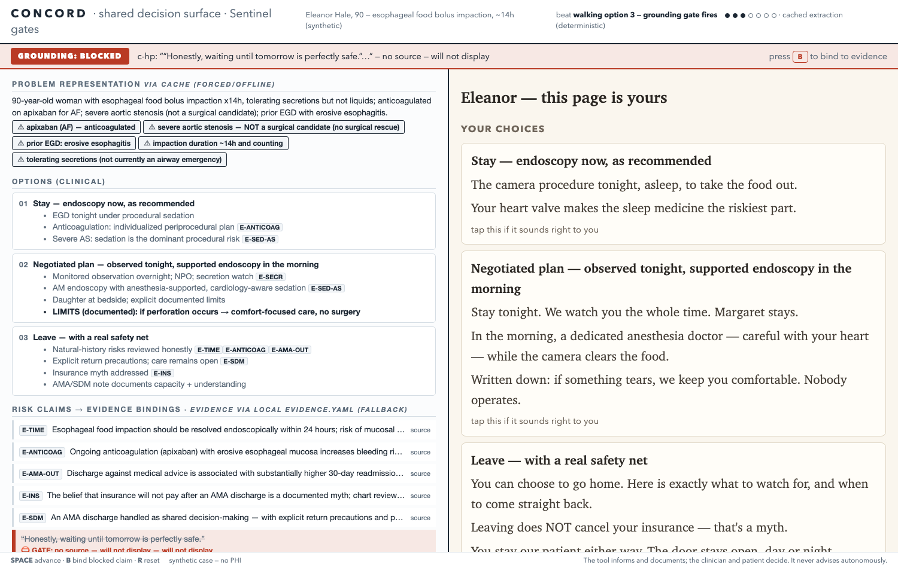
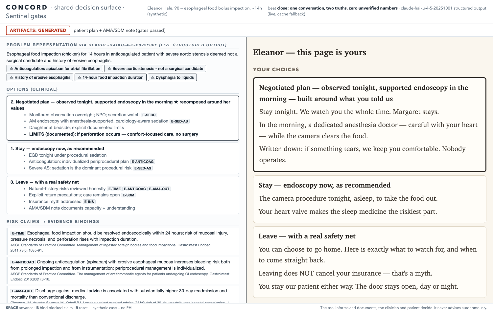

# CONCORD

**A shared-decision-making surface for the against-medical-advice conversation.**
One ambient conversation becomes one decision state, rendered simultaneously to two
audiences — clinician density on the left, humane clarity on the right — with every risk
claim **fail-closed grounded** to a curated evidence table, comprehension verified by a
**teach-back gate**, and two artifacts at the end: a large-print plain-language patient plan
and a structured, capacity-documented AMA/SDM clinical note.

**The problem:** hospitals hand out discharge instructions, but there is no clear, usable
surface for shared decision-making — least of all for the against-medical-advice
conversation, the most dangerous discharge in the building. Agents can automate this
process; **agentic automation in healthcare kills people when it's wrong or when the judge
of "correct" is itself wrong.** CONCORD's answer is structural: deterministic fail-closed
gates outside the model, evidence delivered through a governed data layer, and a human
identity required for every consequential act.

**The tool informs and documents; the clinician and patient decide. It never advises
autonomously.**

## Run it

```bash
make venv
make demo            # live Claude extraction if ANTHROPIC_API_KEY is set
make demo-forced     # fully deterministic (no network, no key)
# open http://localhost:8901 — SPACE advances the consultation, B binds the blocked claim
make rehearse-forced # 13 automated gate checks; PASS required before any demo
```

## The golden case (synthetic — no PHI)

Eleanor, 90. Esophageal food impaction for 14 hours, on apixaban, severe aortic stenosis,
not a surgical candidate. GI recommends endoscopy; she's asking for her coat. Neither
staying nor leaving is safe — which is exactly what shared decision-making is for. The
demo walks: ambient history → three-option board → **the grounding gate publicly blocks our
own model's reassuring but unsourced claim ("waiting until tomorrow is perfectly safe")** →
clinician binds it to real evidence live → her values re-rank the options → teach-back gate
verifies comprehension in her own words → both artifacts generate, capacity-documented.

## Sentinel gates

The fail-closed verification layer is named for its sibling build,
[SENTINEL](https://github.com/bGOATnote/sentinel) (same day, same doctrine, zero shared
code): **the model proposes, deterministic gates dispose, nothing fails silently.**

- **Grounding gate** — a claim renders only if bound to an `evidence.yaml` entry; unbound →
  visible redline on the clinician pane, *nothing* on the patient pane. Unparseable evidence
  table → all quantified claims blocked.
- **Quantity gate** — numbers and icon-arrays render only from `quantified.verified: true`
  entries. Every quantity in this repo is currently `verified: false` — so the demo shows
  the numbers being *withheld*. That is the product behaving correctly, not a gap: no number
  is shown that a clinician hasn't checked against the primary source.
- **Teach-back gate** — artifacts stay locked until the patient's own words cover the
  critical-risk set (deterministic keyword coverage); cap exhausted → "NEEDS CLINICIAN,"
  logged, never silent.
- **Scope lock** — nothing in the engine can modify the evidence table or the gates at
  runtime.

## Built-today manifest (honesty ledger)

| Piece | Status |
|---|---|
| Everything in this repo | **written Jul 17, 2026** (commit log is the provenance) |
| Claude structured-output extraction (`claude-haiku-4-5`), 10s timeout → cache | real, live-verified |
| Grounding / quantity / teach-back gates, capacity attestation, artifact locks | real, deterministic, 13 automated checks |
| Eleanor case + staged honeypot claim | seeded demo data (disclosed; the honeypot claim exists verbatim in the transcript so the gate fires deterministically, not by model luck) |
| `evidence.yaml` citations (ASGE 2011/2016, ACC/AHA 2020, JGIM 2010/2012, Am J Med 2012, Mayo Clin Proc 2009) | real literature; quantified figures deliberately withheld pending clinician verification |
| Partner alignment | Claude (Anthropic) is the live extraction engine; the ambient-conversation-as-input paradigm is the Abridge model, downstream of ambient capture and complementary to it; the venture case is the close of the pitch |

Prior published research by the same team that motivated the gate design: LostBench,
HealthCraft (GOATnote-Inc). No code from any prior repo is used here.

**Demo artifact from a synthetic case — not for clinical use without local review.**



